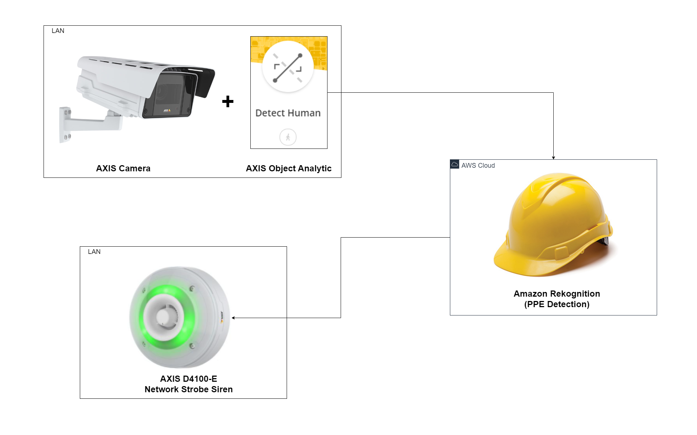
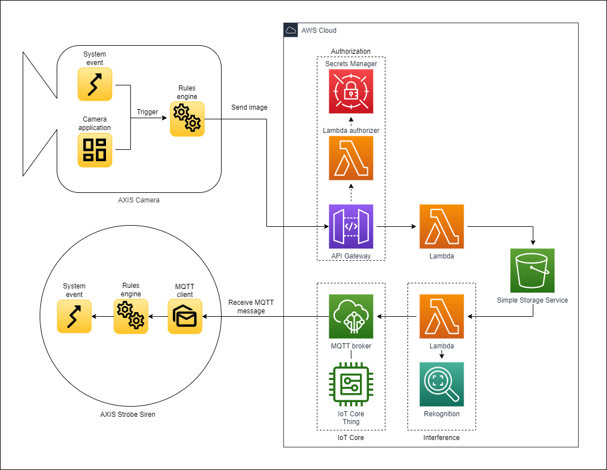
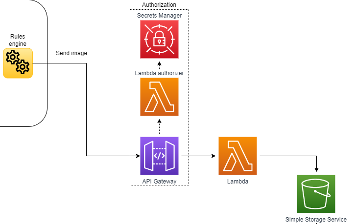
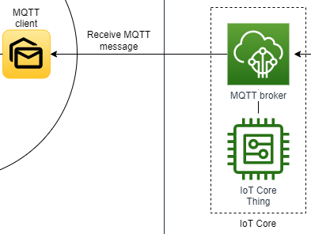
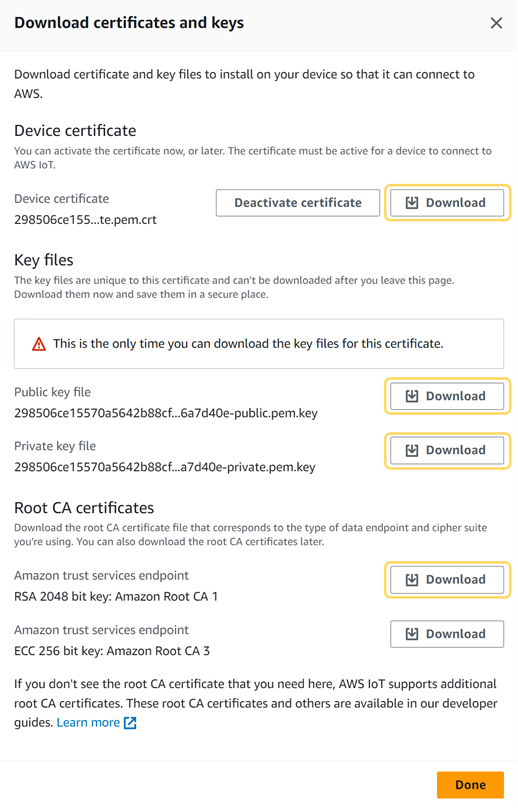
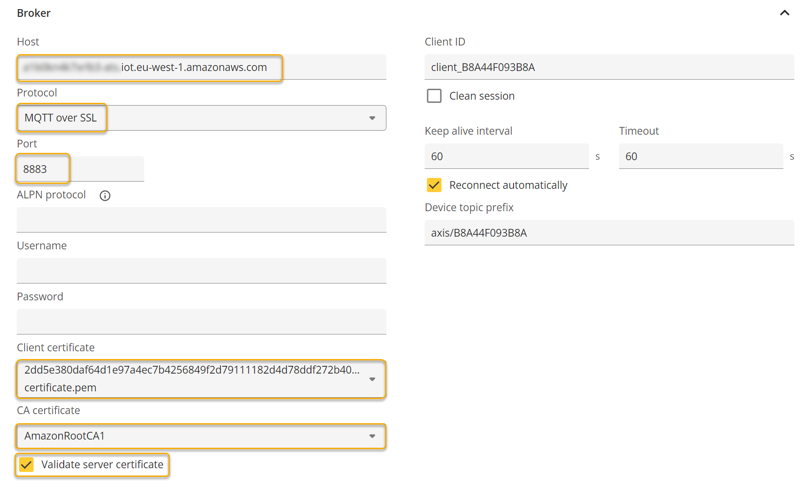
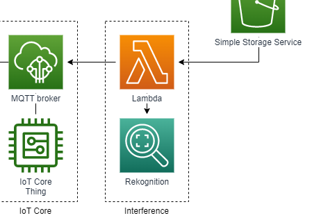
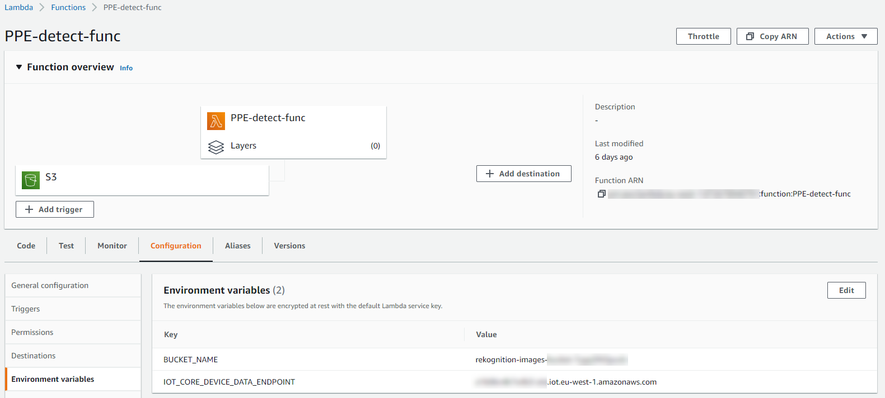
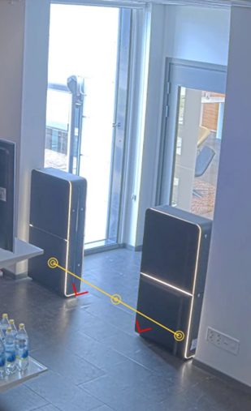
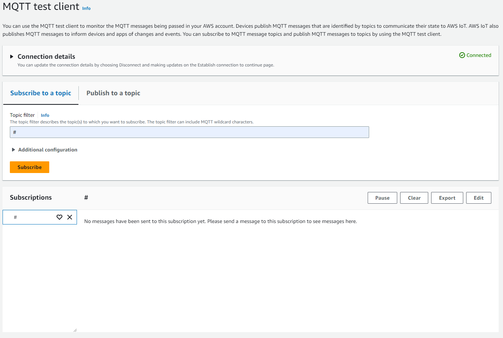

*©2023 Axis Communications AB. AXIS COMMUNICATIONS, AXIS, ARTPEC and VAPIX are registered trademarks of Axis AB in various jurisdictions. All other trademarks are the property of their respective owners.*

# Hard hat detection using Axis Object Analytics and Amazon Rekognition

## Table of contents

- [Hard hat detection using Axis Object Analytics and Amazon Rekognition](#hard-hat-detection-using-axis-object-analytics-and-amazon-rekognition)
  - [Table of contents](#table-of-contents)
  - [Overview](#overview)
  - [Prerequisites](#prerequisites)
  - [Solution setup](#solution-setup)
    - [Camera image to Amazon S3 bucket](#camera-image-to-amazon-s3-bucket)
    - [AWS IoT Core (MQTT Broker) and MQTT client](#aws-iot-core-mqtt-broker-and-mqtt-client)
    - [AWS PPE detection (Interference)](#aws-ppe-detection-interference)
    - [Axis Object Analytics and event setup](#axis-object-analytics-and-event-setup)
    - [Strobe siren event and MQTT subscribe](#strobe-siren-event-and-mqtt-subscribe)
  - [Test and validation](#test-and-validation)
  - [Disclaimer](#disclaimer)
  - [License](#license)

## Overview

***Föreslår att använda antingen camera eller device i hela dokumentet***

This tutorial describes a solution for how to detect Personal Protective Equipment (PPE) in an image sent from an Axis camera to Amazon Web Services (AWS) cloud services. The image upload to AWS cloud is triggered by [AXIS Object Analytics](https://www.axis.com/products/axis-object-analytics) running on the camera.\
After the PPE detection is made by Amazon Rekognition service, the result is transferred via MQTT to [AXIS D4100-E Network Strobe Siren](https://www.axis.com/products/axis-d4100-e-network-strobe-siren) which will signal a positive (green) or negative (red) result if the PPE (helmet) is on or off.


The architectural overview below illustrates the components (hardware and software) and protocols needed in order to setup the solution.

> **Note** *Some components can be replaced to get a solution that fits other use-cases.
For example, replace AXIS Object Analytics  with another application that triggers when an image should be sent to the AWS cloud. Or replace the Axis Strobe Siren with an Axis door station to change the output and result of the solution.
Modifying the Lambda function that calls the rekognition service is also possible if the use case requires other detection types.*
UPPDATERA BILD NEDAN (AOA står fel)



## Prerequisites

1. Camera running [AXIS Object Analytics](https://www.axis.com/products/axis-object-analytics)
2. [AXIS D4100-E Network Strobe Siren](https://www.axis.com/products/axis-d4100-e-network-strobe-siren)
3. Access to AWS cloud services.

> **Note** The Amazon Rekognition service isn't available in all regions. For this setup to work, select one of its [supported regions](https://docs.aws.amazon.com/general/latest/gr/rekognition.html) for all AWS services used in this guide.
>
> [Click here](https://www.axis.com/products/axis-object-analytics#compatible-products) to see AXIS Object Analytics compatible cameras.

## Solution setup

The solution is divided into the sections below which will be described in detail during this tutorial.

3.1 Camera image to Amazon Simple Storage Service (S3) bucket\
3.2 AWS IoT Core (MQTT Broker) and MQTT client\
3.3 AWS PPE detection (Interference)\
3.4 AXIS Object Analytics and event setup\
3.5 Strobe siren event and MQTT subscribe

\
\
*Detailed overview where all cloud services are shown.*
Saknas inte AOA under camera application? Var hör 3.4 hemma då?

### Camera image to Amazon S3 bucket

The image below illustrates the upload of a camera image to an Amazon S3 bucket.



How to setup the Amazon S3 and the required peripheral services to handle the authentication is described here: [Sending images from a camera to Amazon S3](<https://github.com/AxisCommunications/acap-integration-examples-aws/tree/main/images-to-aws-s3>)

> **Note:** Follow the instructions in the repository **Sending images from a camera to Amazon S3** up until the section called **Configure the camera**. After that, return back to this tutorial to setup the rest of the solution.

### AWS IoT Core (MQTT Broker) and MQTT client

In this section we will setup an AWS IoT Core service and connect it to the MQTT client in the Axis Strobe Siren.



**Setup an IoT Core thing**

1. Sign in to the [AWS Console](https://aws.amazon.com/console/) and search for **IoT Core**.
2. Go to **Manage** > **All devices** > **Things** and click **Create things**.
3. Select **Create single thing** and click **Next**.
4. Enter a unique name and click **Next**.
5. At the **Configure device certificate** page, select **Auto-generate a new certificate** and click **Next**.
6. Create a new policy or attach an existing one to the certificate. You're redirected to a new page if you create a new policy. For this tutorial, create a new policy with two statements:
    - First statement
        - **Policy effect**: `Allow`
        - **Policy action**: `iot:Connect`
        - **Policy resource**: `*`
    - Second statement
        - **Policy effect**: `Allow`
        - **Policy action**: `iot:Publish`
        - **Policy resource**: `*`

    > **Warning** Not restricting the policy resource is acceptable in an exploratory phase, but applying [least-privilege permissions](https://docs.aws.amazon.com/IAM/latest/UserGuide/best-practices.html#grant-least-privilege) is a requirement before going to production.

7. Return to the previous page to attach the applicable policies and click **Create thing**.
8. Download the **Device certificate**, **Public key file**, **Private key file** and the **Root CA certificate**.

    \
    *Screenshot from AWS Console*

9. Click **Done**.

**Setup MQTT client in Axis device**

In the Axis device, install the client and CA certificates to enable a secure MQTT connection to the AWS IoT Core MQTT broker:

1. Log in to the Axis device and go to **System** > **Security**.
2. Click **Add certificate**.
3. Select **Upload a client-server certificate using a separate private key** and click **Next**.
4. Upload the client certificate (filename ends with `certificate.pem.crt`) and the private key (filename ends with `private.pem.key`) and click **Next**.
5. Click **Install** and then **Close**.
6. Click **Add certificate** again and select **Upload a CA certificate**.
7. Upload the root CA certificate (`AmazonRootCA1.pem`).
8. Click **Next** and then **Install**.

Next, configure the camera's MQTT client:
*ETT EXEMPEL PÅ CAMERA OCH DEVICE. Bättre att använda ett och samma uttryck genom hela dokumentet.*

1. In the Axis camera go to **System** > **MQTT**.
2. In the **Host** field, enter the hostname for the IoT Core MQTT broker. You can find the hostname (endpoint) to the MQTT broker in the AWS Console under **IoT Core** > **Settings**.
3. In the **Protocol** drop-down menu, select **MQTT over SSL** using default port **8883**.
4. In the **Client certificate** field, select the previously uploaded client certificate.
5. In the **CA certificate** field, select the previously uploaded CA certificate.
6. Select **Validate server certificate**.
7. Click **Save**.
8. Turn on **Connect**.

Here's an example of an **MQTT client** setup in an Axis device.

\
*©2023 Axis Communications AB. All rights reserved.*

### AWS PPE detection (Interference)

This section explains how to setup and configure the Lambda function to grab an image from the Amazon S3 bucket, input the image to the Amazon Rekognition service and finally transfer the result of the detection (helmet on or off) to the IoT core (MQTT broker).



**Create a Lambda function**

1. Sign in to the [AWS Console](https://aws.amazon.com/console/) and search for Lambda.
2. Create a new Lambda function.
    - Select Author from scratch
    - Set a name for the function
    - Select Node.js 14.x as runtime
    - Select x86_64 as architecture.
    - Click Create function.

**Setup the Lambda function**

1. Add a trigger to the Amazon S3 bucket where you store the uploaded images.
2. Add below code to the index.js file within your Lambda function.

 ```javascript
 const AWS = require("aws-sdk");

const BUCKET_NAME = process.env.BUCKET_NAME;
const IOT_CORE_DEVICE_DATA_ENDPOINT = process.env.IOT_CORE_DEVICE_DATA_ENDPOINT;

const rekognition = new AWS.Rekognition();
const iotData = new AWS.IotData({
  endpoint: IOT_CORE_DEVICE_DATA_ENDPOINT,
});

const anyPersonWithoutProtectiveEquipment = async (objectKey) => {
  const req = {
    Image: {
      S3Object: {
        Bucket: BUCKET_NAME,
        Name: objectKey,
      },
    },
    SummarizationAttributes: {
      MinConfidence: 50,
      RequiredEquipmentTypes: ["HEAD_COVER"],
    },
  };

  const res = await rekognition.detectProtectiveEquipment(req).promise();
  return res.Summary.PersonsWithoutRequiredEquipment.length > 0;
};

const publishMessage = async (alarm) => {
  const message = {
    topic: alarm ? "ppe/alarm/on" : "ppe/alarm/off",
    payload: JSON.stringify({ message: "PPE detection payload" }),
  };

  await iotData.publish(message).promise();
};

const handler = async (event) => {
  if (!event || !event.Records || event.Records.length !== 1) {
    console.log(`unexpected event structure: ${JSON.stringify(event)}`);
    return;
  }

  const objectKey = event.Records[0].s3.object.key;
  console.log(`bucket: ${BUCKET_NAME}, object key: ${objectKey}`);

  const alarm = await anyPersonWithoutProtectiveEquipment(objectKey);
  await publishMessage(alarm);
};

module.exports = {
  handler,
};
```

3. Go to **Configuration** of the Lambda function and setup two **Environment variables**. One for the bucket name and one for the IoT Core endpoint.


*Screenshot from AWS Console*

**Lambda function permissions**

Finally, you need to setup correct permissions for the Lambda function to access the Amazon S3 bucket, IoT Core (MQTT Broker) and the Amazon Rekognition service.  

1. Go to **Configuration** > **Permissions** and click on the **Execution role**.
2. In the **IAM** (Identity and Access Management) console you should add permissions for the three services:
    - Amazon S3 (`s3:GetObject` and `s3:GetObjectVersion`)
    - Amazon Rekognition (`rekognition:DetectProtectiveEquipment`)
    - IoT Core (`iot:Publish`)
3. Click **add permissions** dropdown and select **Attach policies**.
4. Now click **Create Policy** and add Amazon S3 as a service and read access to `GetObject` and `GetObjectVersion`.
5. Click **next** > **next** until you can set a name for your policy.
6. Save the policy and attach the policy to your role.

Create two more policies (one for the Amazon Rekognition service and one for the IoT Core service) and attach them to your Lambda function role.

- The Amazon Rekognition policy should have at least read access to action: `rekognition:DetectProtectiveEquipment`
- The IoT policy should have write access to action: `iot:Publish`

### Axis Object Analytics and event setup

\
**Line Crossing in Axis Object Analytics**

1. In the Axis camera, start the AXIS Object Analytics application by navigating to **Apps** and click **open**.
2. Setup a line crossing scenario where you want to capture an image that is sent to Amazon S3.

\
*Example of a line crossing scenario in AXIS Object Analytics*

**Axis camera event setup**

Now it is time to setup a HTTPS recipient to the AWS API Gateway and an event that is used as a trigger when an image should be uploaded.

1. In the camera navigate to **System** > **Events**.
2. In the **Recipients** tab click the plus sign to add the API Gateway recipient URL.
    > **Note:** Username and password is not needed here, the authentication is handled via the access token `accessToken` that you will enter in the **Rules** section under **Custom CGI parameters**.
3. In the **Rules** tab click the plus sign to add a new rule.
    - Select an condition for when to send an image to Amazon S3. E.g. **AXIS Object Analytics: Scenario x**.
    - Set post buffer to 1 second and the **Maximum images** to 1.
    - Add the `accessToken` under **Custom CGI parameters**. E.g. `accessToken=abcdefghijklmnopqrstuvxyz123`

The camera is now configured to send an image every time a person crosses the line that was setup in Axis Object Analytics.

### Strobe siren event and MQTT subscribe

This section explains how to setup MQTT subscribe in the strobe siren and how to tie the MQTT topic to different event that controls the strobe sirens light or sound.

**MQTT subscribe setup**

1. In the strobe siren under **System** > **MQTT** go to **MQTT subscriptions** and add a new subscription.
2. Set a MQTT topic that correspond to the Rekognition Lambda function topic. E.g. `ppe/alarm/on` and `ppe/alarm/off`.
    > **Note:** Remember to uncheck the tick box “Use default topic prefix”.
3. Repeat the subscription configuration for one more color so that the trigger from the Amazon Rekognition service can change color based on PPE detection.

**Strobe siren profile setup**

1. In the strobe siren add a new profile, give it a name (example `green-light`), and configure the desired signaling.
2. Create a second profile for some other color or sound (example `red-light`).

**Event setup**

1. In the strobe siren, go to **System** > **Events** and add a rule.
2. Tie the condition to MQTT stateless and the subscription created earlier.
3. Tie the Action to the profile created earlier.

## Test and validation

Test the solution by triggering the line crossing in AXIS Object Analytics. The output should be a red or green light on the strobe siren depending if you have a helmet on or not.

To investigate the MQTT messages on the IoT Core MQTT broker you can login to the Amazon console and go to AWS IoT. Here you can see all the traffic on the broker if you subscribe with the wildcard **#**.


*Screenshot from AWS Console*

## Disclaimer

<!-- textlint-disable -->

This document and its content are provided courtesy of Axis and all rights to the document shall remain vested in Axis Communications AB. AXIS COMMUNICATIONS, AXIS, ARTPEC and VAPIX are registered trademarks of Axis AB in various jurisdictions. All other trademarks are the property of their respective owners. The Grafana Labs Marks are trademarks of Grafana Labs, and are used with Grafana Labs’ permission. We are not affiliated with, endorsed or sponsored by Grafana Labs or its affiliates. Amazon Web Services, AWS and the Powered by AWS logo are trademarks of Amazon.com, Inc. or its affiliates.

As described in this document, you may be able to connect to, access and use third party products, web sites, example code, software or services (“Third Party Services”). You acknowledge that any such connection and access to such Third Party Services are made available to you for convenience only. Axis does not endorse any Third Party Services, nor does Axis make any representations or provide any warranties whatsoever with respect to any Third Party Services, and Axis specifically disclaims any liability or obligations with regard to Third Party Services. The Third Party Services are provided to you in accordance with their respective terms and conditions, and you alone are responsible for ensuring that you (a) procure appropriate rights to access and use any such Third Party Services and (b) comply with the terms and conditions applicable to its use.

PLEASE BE ADVISED THAT THIS DOCUMENT IS PROVIDED “AS IS” WITHOUT WARRANTY OF ANY KIND, AND IS NOT INTENDED TO, AND SHALL NOT, CREATE ANY LEGAL OBLIGATION FOR AXIS COMMUNICATIONS AB AND/OR ANY OF ITS AFFILIATES. THE ENTIRE RISK AS TO THE USE, RESULTS AND PERFORMANCE OF THIS DOCUMENT AND ANY THIRD PARTY SERVICES REFERENCED HEREIN IS ASSUMED BY THE USER OF THE DOCUMENT AND AXIS DISCLAIMS AND EXCLUDES, TO THE MAXIMUM EXTENT PERMITTED BY LAW, ALL WARRANTIES, WHETHER STATUTORY, EXPRESS OR IMPLIED, INCLUDING BUT NOT LIMITED TO ANY IMPLIED WARRANTIES OF MERCHANTABILITY, FITNESS FOR A PARTICULAR PURPOSE, TITLE AND NON-INFRINGEMENT AND PRODUCT LIABILITY.

<!-- textlint-enable -->

## License

Example Code means the examples provided by Axis in this document within the grey text boxes.

Example Code ©2023 Axis Communications AB is licensed under the [Apache License, Version 2.0 (the “License”)](./LICENSE). You may not use the Example Code except in compliance with the License.

You may obtain a copy of the License at <https://www.apache.org/licenses/LICENSE-2.0>. Example Code distributed under the License is distributed on an “AS IS” BASIS, WITHOUT WARRANTIES OR CONDITIONS OF ANY KIND, either express or implied. See the License for the specific language governing permissions and limitations under the License.
