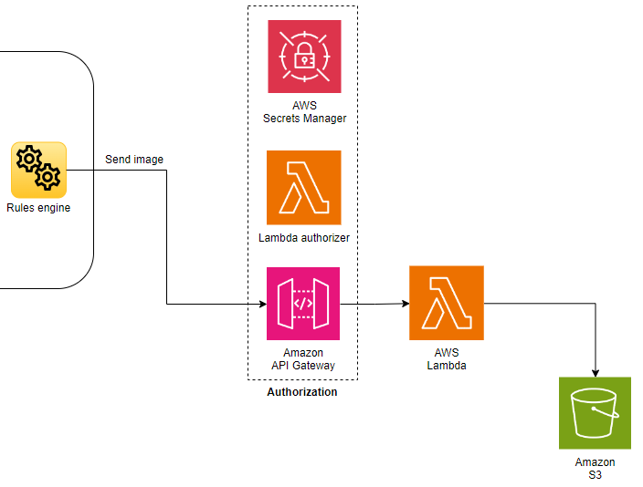

*©2023 Axis Communications AB. AXIS COMMUNICATIONS, AXIS, ARTPEC and VAPIX are registered trademarks of Axis AB in various jurisdictions. All other trademarks are the property of their respective owners.*

<!-- omit from toc -->
# Hard hat detection using AXIS Object Analytics and Amazon Rekognition

<!-- omit from toc -->
## Table of contents

- [Overview](#overview)
- [Prerequisites](#prerequisites)
- [Solution setup](#solution-setup)
    - [Camera image to Amazon S3 bucket](#camera-image-to-amazon-s3-bucket)
    - [AWS IoT Core and MQTT client](#aws-iot-core-and-mqtt-client)
    - [Amazon Rekognition PPE detection (inference)](#amazon-rekognition-ppe-detection-inference)
    - [AXIS Object Analytics (camera application) and event setup](#axis-object-analytics-camera-application-and-event-setup)
    - [Strobe siren event and MQTT subscribe](#strobe-siren-event-and-mqtt-subscribe)
- [Test and validation](#test-and-validation)
- [Disclaimer](#disclaimer)
- [License](#license)

## Overview

This tutorial describes a solution that detects personal protective equipment (PPE), such as a helmet, in an image sent from an Axis camera to [Amazon Web Services (AWS)](https://aws.amazon.com/) cloud services. [AXIS Object Analytics](https://www.axis.com/products/axis-object-analytics) running on the camera triggers the image upload to AWS.

Amazon Rekognition transfers the result to [AXIS D4100-E Network Strobe Siren](https://www.axis.com/products/axis-d4100-e-network-strobe-siren) via MQTT after it makes the PPE detection. The network strobe siren signals green to indicate that the helmet is on and red if the helmet is off.


The architectural overview below shows the required components (hardware and software) and protocols to set up the solution.

> **Note**
>
> You can replace some components to develop solutions for other use cases. For example, replace AXIS Object Analytics with another application to send images to AWS. Or replace the Axis strobe siren with an Axis door station to change the output and result of the solution.
>
> Modifying the AWS Lambda function that calls the Amazon Rekognition is also possible if the use case requires other detection types.


## Prerequisites

- Camera running [AXIS Object Analytics](https://www.axis.com/products/axis-object-analytics) - Click [here](https://www.axis.com/products/axis-object-analytics#compatible-products) to find compatible cameras.
- [AXIS D4100-E Network Strobe Siren](https://www.axis.com/products/axis-d4100-e-network-strobe-siren)
- Access to AWS - Amazon Rekognition isn't available in all regions. For this setup to work, select one of its [supported regions](https://docs.aws.amazon.com/general/latest/gr/rekognition.html) for all AWS services used in this guide.

## Solution setup

These are the main steps of this tutorial:

- Camera image to Amazon Simple Storage Service (Amazon S3) bucket
- AWS IoT Core, acting as a MQTT broker, and MQTT client
- Amazon Rekognition PPE detection (inference)
- AXIS Object Analytics (camera application) and event setup
- Strobe siren event and MQTT subscribe

\
*Detailed overview showing all cloud services.*

### Camera image to Amazon S3 bucket

The image below illustrates the upload of a camera image to an Amazon S3 bucket.



 [Sending images from a camera to Amazon S3](https://github.com/AxisCommunications/acap-integration-examples-aws/tree/main/images-to-aws-s3) describes how to set up the Amazon S3 and the required peripheral services to handle the authentication.

> **Note** Follow the instructions up until the section called **Configure the camera**. Afterward, return to this tutorial to set up the rest of the solution.

### AWS IoT Core and MQTT client

In this section we'll set up AWS IoT Core and connect it to the MQTT client in the Axis strobe siren.


#### Set up an AWS IoT Core thing

1. Sign in to the [AWS Management Console](https://aws.amazon.com/console/) and search for **IoT Core**.
2. Go to **Manage** > **All devices** > **Things** and click **Create things**.
3. Select **Create single thing** and click **Next**.
4. Enter a unique name and click **Next**.
5. On the **Configure device certificate** page, select **Auto-generate a new certificate** and click **Next**.
6. Create a new policy or attach an existing one to the certificate. You're redirected to a new page if you create a new policy. For this tutorial, create a new policy with two statements:
    - First statement
        - **Policy effect**: `Allow`
        - **Policy action**: `iot:Connect`
        - **Policy resource**: `*`
    - Second statement
        - **Policy effect**: `Allow`
        - **Policy action**: `iot:Publish`
        - **Policy resource**: `*`

    > **Warning** Not restricting the policy resource is acceptable in an exploratory phase, but applying [least-privilege permissions](https://docs.aws.amazon.com/IAM/latest/UserGuide/best-practices.html#grant-least-privilege) is a requirement before going to production.

7. Return to the previous page to attach the applicable policies and click **Create thing**.
8. Download the **Device certificate**, **Public key file**, **Private key file** and the **Root CA certificate**.

    \
    *Screenshot from AWS Management Console*

9. Click **Done**.

#### Set up an MQTT client in an Axis device

In the Axis device, install the client and CA certificates to enable a secure MQTT connection to the AWS IoT Core:

1. Log in to the Axis device and go to **System** > **Security**.
2. Click **Add certificate**.
3. Select **Upload a client-server certificate using a separate private key** and click **Next**.
4. Upload the client certificate (filename ends with `certificate.pem.crt`) and the private key (filename ends with `private.pem.key`) and click **Next**.
5. Click **Install** and then **Close**.
6. Click **Add certificate** again and select **Upload a CA certificate**.
7. Upload the root CA certificate (`AmazonRootCA1.pem`).
8. Click **Next** and then **Install**.

Next, configure the device's MQTT client:

1. In the Axis device go to **System** > **MQTT**.
2. In the **Host** field, enter the hostname for AWS IoT Core. You can find the hostname (device data endpoint) in the AWS Management Console under **IoT Core** > **Settings**.
3. In the **Protocol** drop-down menu, select **MQTT over SSL** using the default port **8883**.
4. In the **Client certificate** field, select the previously uploaded client certificate.
5. In the **CA certificate** field, select the previously uploaded CA certificate.
6. Select **Validate server certificate**.
7. Click **Save**.
8. Turn on **Connect**.

Here's an example of an **MQTT client** setup in an Axis device.

\
*©2023 Axis Communications AB. All rights reserved.*

### Amazon Rekognition PPE detection (inference)

This section explains how to set up and configure the AWS Lambda function to grab an image from the Amazon S3 bucket, input the image to Amazon Rekognition, and transfer the detection result (helmet on or off) to AWS IoT Core.


#### Create an AWS Lambda function

1. Sign in to the [AWS Management Console](https://aws.amazon.com/console/) and search for Lambda.
2. Create a new AWS Lambda function.
    - Select Author from scratch
    - Set a name for the function
    - Select Node.js 14.x as runtime
    - Select x86_64 as architecture.
    - Click Create function.

#### Set up the AWS Lambda function

1. Add a trigger to the Amazon S3 bucket where you store the uploaded images.
2. Add the code below to the `index.js` file within your AWS Lambda function.

    ```javascript
    const AWS = require("aws-sdk");

    const BUCKET_NAME = process.env.BUCKET_NAME;
    const IOT_CORE_DEVICE_DATA_ENDPOINT = process.env.IOT_CORE_DEVICE_DATA_ENDPOINT;

    const rekognition = new AWS.Rekognition();
    const iotData = new AWS.IotData({
    endpoint: IOT_CORE_DEVICE_DATA_ENDPOINT,
    });

    const anyPersonWithoutProtectiveEquipment = async (objectKey) => {
    const req = {
        Image: {
        S3Object: {
            Bucket: BUCKET_NAME,
            Name: objectKey,
        },
        },
        SummarizationAttributes: {
        MinConfidence: 50,
        RequiredEquipmentTypes: ["HEAD_COVER"],
        },
    };

    const res = await rekognition.detectProtectiveEquipment(req).promise();
    return res.Summary.PersonsWithoutRequiredEquipment.length > 0;
    };

    const publishMessage = async (alarm) => {
    const message = {
        topic: alarm ? "ppe/alarm/on" : "ppe/alarm/off",
        payload: JSON.stringify({ message: "PPE detection payload" }),
    };

    await iotData.publish(message).promise();
    };

    const handler = async (event) => {
    if (!event || !event.Records || event.Records.length !== 1) {
        console.log(`unexpected event structure: ${JSON.stringify(event)}`);
        return;
    }

    const objectKey = event.Records[0].s3.object.key;
    console.log(`bucket: ${BUCKET_NAME}, object key: ${objectKey}`);

    const alarm = await anyPersonWithoutProtectiveEquipment(objectKey);
    await publishMessage(alarm);
    };

    module.exports = {
    handler,
    };
    ```

3. Go to **Configuration** of the AWS Lambda function and set up two **Environment variables**. One for the bucket name and one for the AWS IoT Core endpoint.

\
*Screenshot from AWS Management Console*

#### AWS Lambda function permissions

Finally, set up the correct permissions for the AWS Lambda function to access the Amazon S3 bucket, AWS IoT Core and Amazon Rekognition.

1. Go to **Configuration** > **Permissions** and click the **Execution role**.
2. In the **IAM** (Identity and Access Management) console, add permissions for the three services:
    - Amazon S3 (`s3:GetObject` and `s3:GetObjectVersion`)
    - Amazon Rekognition (`rekognition:DetectProtectiveEquipment`)
    - AWS IoT Core (`iot:Publish`)
3. Select **Attach policies** from the **add permissions** dropdown.
4. Click **Create Policy** and add Amazon S3 as a service and read access to `GetObject` and `GetObjectVersion`.
5. Click **next** > **next** until you can set a name for your policy.
6. Save the policy and attach the policy to your role.

Create two more policies (one for Amazon Rekognition and one for AWS IoT Core) and attach them to your AWS Lambda function role.

- The Amazon Rekognition policy should have at least read access to the `rekognition:DetectProtectiveEquipment` action.
- The AWS IoT Core policy should have write access to the `iot:Publish` action.

### AXIS Object Analytics (camera application) and event setup

#### Line Crossing in AXIS Object Analytics

1. In the Axis camera, go to **Apps** and click **open** to start the AXIS Object Analytics application.
2. Set up a line crossing scenario where you want to capture an image and send it to Amazon S3.

\
*Example of a line crossing scenario in AXIS Object Analytics*

#### Set up Axis camera event

Now it is time to set up an HTTPS recipient to the Amazon API Gateway and an event that triggers an image upload.

1. In the Axis camera go to **System** > **Events**.
2. On the **Recipients** tab click **+** to add the Amazon API Gateway recipient URL.
    > **Note** You don't need to enter a username and password here. The access token `accessToken` in the **Rules** section under **Custom CGI parameters** handles the authentication.
3. On the **Rules** tab click **+** to add a new rule.
    - Select a condition for sending an image to Amazon S3, for example, **AXIS Object Analytics: Scenario x**.
    - Set the post buffer to 1 second and the **Maximum images** to 1.
    - Add the `accessToken` under **Custom CGI parameters**, for example, `accessToken=abcdefghijklmnopqrstuvxyz123`

The camera will now send an image every time a person crosses the line that you created in AXIS Object Analytics.

### Strobe siren event and MQTT subscribe

This section explains how to set up MQTT subscribe in the strobe siren and tie the MQTT topic to different events that control the strobe siren's light or sound.

#### Set up MQTT subscribe

1. In the strobe siren under **System** > **MQTT** go to **MQTT subscriptions** and add a new subscription.
2. Set an MQTT topic that corresponds to the Amazon Rekognition AWS Lambda function topic, for example, `ppe/alarm/on` and `ppe/alarm/off`.
    > **Note** Remember to clear “Use default topic prefix”.
3. Repeat the subscription configuration for one more color so that the trigger from Amazon Rekognition can change color based on PPE detection.

#### Set up a strobe siren profile

1. In the strobe siren add a new profile, give it a name (example `green-light`), and configure the desired signaling.
2. Create a second profile for some other color or sound (example `red-light`).

#### Set up an Event

1. In the strobe siren, go to **System** > **Events** and add a rule.
2. Tie the condition to MQTT stateless and the subscription created earlier.
3. Tie the Action to the profile created earlier.

## Test and validation

To test the solution, trigger the line crossing in AXIS Object Analytics. The Axis strobe siren should light up red or green, depending on whether you're wearing a helmet.

To check the MQTT messages sent to AWS IoT Core, log in to the AWS Management Console and go to AWS IoT Core. You can see all the messages if you subscribe with the wildcard `#`.

\
*Screenshot from AWS Management Console*

## Disclaimer

<!-- textlint-disable -->

This document and its content are provided courtesy of Axis and all rights to the document shall remain vested in Axis Communications AB. AXIS COMMUNICATIONS, AXIS, ARTPEC and VAPIX are registered trademarks of Axis AB in various jurisdictions. Amazon Web Services, AWS and the Powered by AWS logo, Amazon Simple Storage Service (Amazon S3), Amazon Rekognition and AWS Lambda are trademarks of Amazon.com, Inc. or its affiliates. All other trademarks are the property of their respective owners, and we are not affiliated with, endorsed or sponsored by them or their affiliates.

As described in this document, you may be able to connect to, access and use third party products, web sites, example code, software or services (“Third Party Services”). You acknowledge that any such connection and access to such Third Party Services are made available to you for convenience only. Axis does not endorse any Third Party Services, nor does Axis make any representations or provide any warranties whatsoever with respect to any Third Party Services, and Axis specifically disclaims any liability or obligations with regard to Third Party Services. The Third Party Services are provided to you in accordance with their respective terms and conditions, and you alone are responsible for ensuring that you (a) procure appropriate rights to access and use any such Third Party Services and (b) comply with the terms and conditions applicable to its use.

PLEASE BE ADVISED THAT THIS DOCUMENT IS PROVIDED “AS IS” WITHOUT WARRANTY OF ANY KIND, AND IS NOT INTENDED TO, AND SHALL NOT, CREATE ANY LEGAL OBLIGATION FOR AXIS COMMUNICATIONS AB AND/OR ANY OF ITS AFFILIATES. THE ENTIRE RISK AS TO THE USE, RESULTS AND PERFORMANCE OF THIS DOCUMENT AND ANY THIRD PARTY SERVICES REFERENCED HEREIN IS ASSUMED BY THE USER OF THE DOCUMENT AND AXIS DISCLAIMS AND EXCLUDES, TO THE MAXIMUM EXTENT PERMITTED BY LAW, ALL WARRANTIES, WHETHER STATUTORY, EXPRESS OR IMPLIED, INCLUDING BUT NOT LIMITED TO ANY IMPLIED WARRANTIES OF MERCHANTABILITY, FITNESS FOR A PARTICULAR PURPOSE, TITLE AND NON-INFRINGEMENT AND PRODUCT LIABILITY.

<!-- textlint-enable -->

## License

Example Code means the examples provided by Axis in this document within the grey text boxes.

Example Code ©2023 Axis Communications AB is licensed under the [Apache License, Version 2.0 (the “License”)](./LICENSE). You may not use the Example Code except in compliance with the License.

You may obtain a copy of the License at <https://www.apache.org/licenses/LICENSE-2.0>. Example Code distributed under the License is distributed on an “AS IS” BASIS, WITHOUT WARRANTIES OR CONDITIONS OF ANY KIND, either express or implied. See the License for the specific language governing permissions and limitations under the License.
